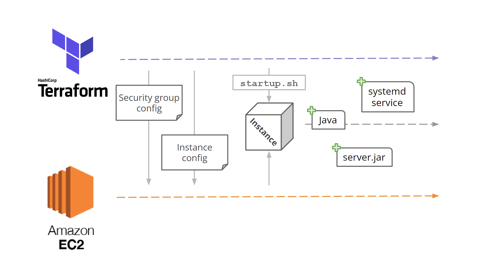

# CS312 Final Project
Final project for System Administration -- Minecraft server using AWS EC2 and Terraform

Author: Julian (Jules) Brinkley

Instructor: Alexander Ulbrich

Date: June 14, 2023

## Introduction



This is a simple pipeline to set up a Minecraft server on AWS EC2 using Terraform. It creates an EC2 instance with a security group, allows inbound traffic on ports 22 and 22565 (SSH and Minecraft), and installs pre-requisities for Minecraft on the instance. It then uses a remote-exec provisioner to download and run the Minecraft server jar file.

## Prerequisites
To use the pipeline, you must have the following:

- [An AWS account](https://aws.amazon.com/)
- [AWS CLI](https://docs.aws.amazon.com/cli/latest/userguide/getting-started-install.html)
- [Terraform](https://learn.hashicorp.com/tutorials/terraform/install-cli)
  - Be sure to add Terraform to your PATH
- Bash terminal helpful (e.g. [Git Bash](https://git-scm.com/downloads))

Next, you need to configure your AWS CLI credentials. To do this, we're going to open the credentials file, found in the .aws folder in your home directory. If you don't have this folder, you can create it, and within it, a file named "credentials" (no extension).

This credentials file needs your AWS secret key and access key. If you're using a standard AWS account, they can be found in your credentials dashboard (handy guide [here](https://www.msp360.com/resources/blog/how-to-find-your-aws-access-key-id-and-secret-access-key/)). You'll need to use the 'aws configure' command in a terminal to add these to the credentials file.

If you're using an education account, your credentials are in the Learner Lab, under AWS details. Click "show" by 'AWS CLI', then copy the credentials into the credentials file.

Now, clone this repository to your local machine.

Your AWS account will also need a key pair to connect to the server. To create one, go to the AWS dashboard, search for "key pairs" in the search bar, and click "Create key pair". Name it 'minecraft', and download the *.pem* file into the cloned repository.

## Usage
Simply open a bash terminal, navigate to the directory containing 'main.tf', and run the following command:

```bash
./tf_commands.sh
```

In short, this script will initialize terraform, apply configuration, and run the remote-exec provisioner. After around 5 minutes, the script should finish and print out the public IP address of the server. Connect however you choose (nmap -sV -Pn -p T:25565 \<instance_public_ip\>, Minecraft client, etc.), and enjoy!

## Destruction
To destroy the server and its resources, run the following command in bash:

```bash
terraform destroy
```

Accept the propmt, and the server will be destroyed.

## Sources
- https://developer.hashicorp.com/terraform/tutorials/aws-get-started
- https://developer.hashicorp.com/terraform/language/resources/provisioners/remote-exec 
- https://github.com/HarryNash/terraform-minecraft
- https://github.com/gerhalt/mining-camp
- CS312 class resources (particularly the Terraform lab)